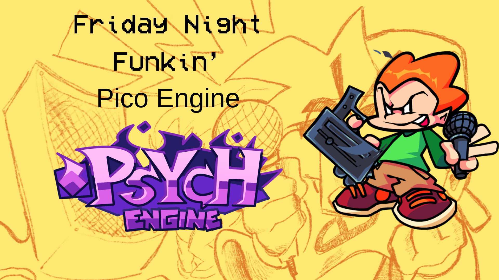
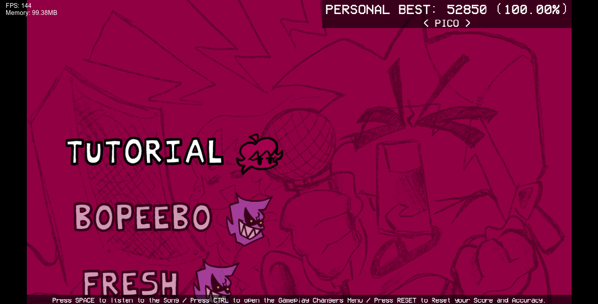
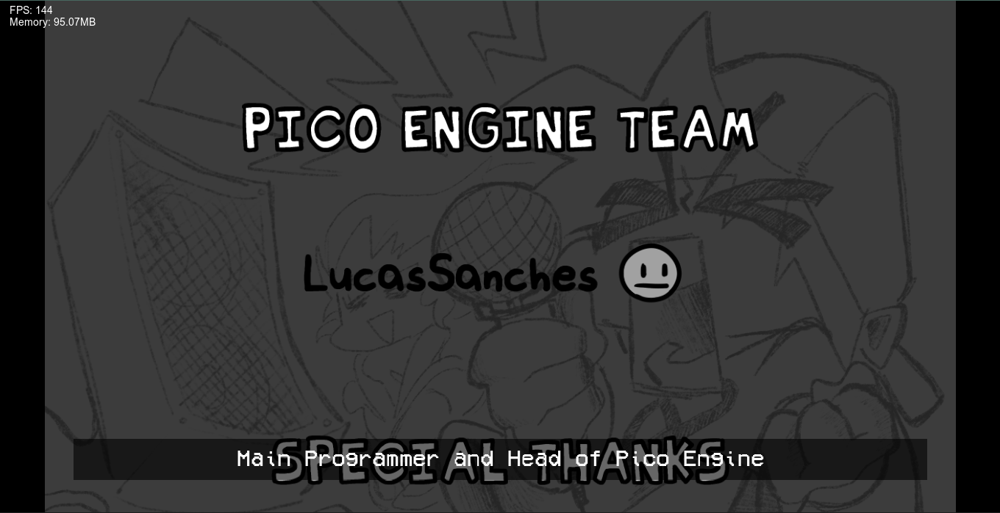
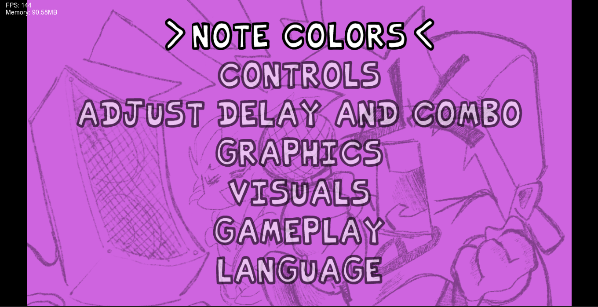

# Friday Night Funkin' Pico Engine

- [Mod also on Gamejolt](https://gamejolt.com/games/Pico-Engine/948902)

# Proposal
- The main purpose of this mod is to bring remixes of Pico, both from the base game and other mods that feature Pico as a playable character

## Menus
## MainMenu

- You can switch between Free Play and Credits, plus the Options Menu

## Freeplay Menu

- Here you can choose the music for the base game with the Pico playable

## Credits Menu

- Here you can see the mod credits
## Options Menu

- Here you can see all the options available for you to use

## Customization
- There isn't a customization option available yet, but I'm working on it

## Credits/SpecialThanks
[Lucas](art/credits/Lucas/Lucas.txt)

[mikolka](art/credits/mikolka/mikolka.txt)

[Psych Engine](art/credits/PsychEngine/PsychEngine.txt)
